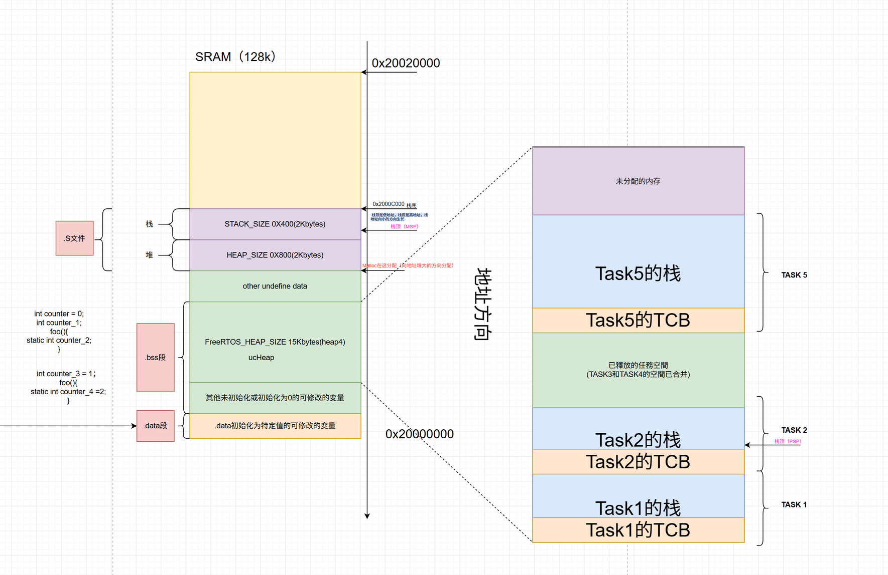

[参考链接01](https://twd6onxsxva.feishu.cn/docx/ZX43d3aFZoFUJixdZrycOT4jnRd)
[参考链接02](https://my.feishu.cn/docx/NYeDdR7dZoDkBZxCrlXcf1DonPd)

---

# 内存分布


--- 


---

<table>
	<tr> 
		<td></td>
		<td></td> 
	</tr>
</table>



---

# 默认初始化流程


这张图展示的是 **ARM 嵌入式系统（通常基于 Cortex-M 内核，如 STM32）在启动时的默认初始化流程**。

更准确地说，这是 **ARM 编译器（ARMCC/ARMCLANG）或 Keil MDK 环境下，C 库（C Library）的启动时序图**。它解释了从单片机复位开始，到进入用户 `main()` 函数之前，系统到底在后台做了哪些“隐秘”的工作。

我们可以把这张图拆解为三个关键部分来理解：

## 一、核心流程解析（从左上角开始）

#### 1.  `__main`（注意是双下划线）

这不是用户写的 `main` 函数，而是 **编译器提供的库函数入口**。

- 当单片机复位后，启动文件（startup file）会跳转到这里。
- **主要任务**：它负责搬运数据。
    - **Copy code and data**：把代码和初始化的数据从 Flash（只读存储区）搬运到 RAM（读写存储区）。
    - **RW data**：读写数据段的初始化。
    - **ZI data**：零初始化数据段（比如 `int a = 0;` 或者未初始化的全局变量），会被强制清零。

#### 2. `__rt_entry`（Runtime Entry）

这是运行时环境的入口。

- **Set up stack and heap**：设置堆栈（Stack）和堆（Heap）。这一步至关重要，没有栈，局部变量就没地方存，函数调用也会崩溃。
- **Initialize library functions**：初始化 C 库（比如 `printf` 需要用到的串口底层等）。
- **C++ constructors**：如果你用了 C++，这里会调用全局对象的构造函数。

#### 3. `main()`（右侧 User Code）

这才是**用户写的代码**。

- 只有当左边的所有初始化（数据搬运、清零、堆栈设置）全部完成后，程序才会跳转到这里执行你的逻辑。

### 4. 为什么这张图很重要？

这张图解释了很多初学者常遇到的“玄学”问题：

- **全局变量为什么有初值？**  
    因为在 `__main` 阶段，系统自动把你在代码里写的初值（比如 `int a = 5;`）从 Flash 复制到了 RAM 里。
- **未初始化的变量为什么默认是 0？**  
    因为在 `__main` 阶段，系统执行了 "Initialize ZI data to zeros"。
- **为什么我的 `main` 函数还没运行，内存就已经准备好了？**  
    因为 `__rt_entry` 在 `main` 之前已经帮你把 Stack 和 Heap 建好了。

## 二、GCC 环境下，启动流程

`Reset_Handler` → `SystemInit`（时钟）→ `_start` / 手动数据搬运 → `__libc_init_array`（库和 C++ 构造）→ `main`

### 1. 从复位到 main：GCC 的完整路径

假设你在用常见的 **STM32 + GCC（arm-none-eabi）** 工程，编译后会有一个启动文件 `startup_stm32xxxx.s` 和一个链接脚本 `STM32xxxx_FLASH.ld`。

#### 1. 硬件复位 → 取栈顶和复位向量
芯片上电，硬件自动从 `0x00000000`（或映射到 `0x08000000` 的 Flash）读取两个值：
- 第一个字（0x00000000）：**初始栈顶地址** → 写道 MSP（主堆栈指针）
- 第二个字（0x00000004）：**复位向量** → 载入 PC，程序跳转到 `Reset_Handler`

这两个值是在链接脚本里定义的，比如栈顶地址常被命名为 `_estack`。

#### 2. Reset_Handler 做了什么？
打开 `startup_stm32xxxx.s` 你会看到类似的结构（只保留关键部分）：
```assembly
Reset_Handler:
    ldr   sp, =_estack         @ 重新设置栈顶（其实硬件已做过，这里保险）


    /* 调用系统时钟初始化 */
    bl    SystemInit           @ 这是 ST 库提供的函数，不是编译器加的


    /* 搬运 .data 段 */
    ldr   r0, =_sdata          @ 目的地址：RAM 中的 .data 起始
    ldr   r1, =_edata          @ 目的结束地址
    ldr   r2, =_sidata         @ 源地址：Flash 中的 .data 映像
    b     LoopCopyDataInit
CopyDataInit:
    ldr   r3, [r2], #4
    str   r3, [r0], #4
LoopCopyDataInit:
    cmp   r0, r1
    bcc   CopyDataInit


    /* 清零 .bss 段 */
    ldr   r0, =_sbss
    ldr   r1, =_ebss
    mov   r2, #0
    b     LoopFillZerobss
FillZerobss:
    str   r2, [r0], #4
LoopFillZerobss:
    cmp   r0, r1
    bcc   FillZerobss


    /* 初始化 C 库和 C++ 构造函数 */
    bl    __libc_init_array


    /* 最终进入用户 main */
    bl    main
    bx    lr
```

**新手注意**：你看到的 `_sdata`、`_edata`、`_sidata`、`_sbss`、`_ebss` 这些符号，**不是芯片定义的，而是链接脚本提供的地址标签**。

#### 3. 链接脚本里的秘密 —— 那些符号是怎么来的？
链接脚本（`.ld`）决定了内存布局。我们截取一段看：
```ld
MEMORY
{
  FLASH (rx) : ORIGIN = 0x08000000, LENGTH = 512K
  RAM  (rwx) : ORIGIN = 0x20000000, LENGTH = 128K
}

SECTIONS
{
  .text : { *(.text) } > FLASH

  /* 保存 .data 的初始值在 Flash 中 */
  .rodata : { ... } > FLASH

  .data : AT ( ADDR (.rodata) + SIZEOF (.rodata) )
  {
    _sdata = .;          /* .data 段在 RAM 中的起始地址 */
    *(.data)
    _edata = .;          /* .data 段在 RAM 中的结束地址 */
  } > RAM

  /* _sidata 就是 .data 段在 Flash 中存放初始值的起始地址 */
  _sidata = LOADADDR (.data);

  .bss :
  {
    _sbss = .;           /* .bss 段在 RAM 中的起始地址 */
    *(.bss)
    _ebss = .;           /* .bss 段在 RAM 中的结束地址 */
  } > RAM

  _estack = ORIGIN(RAM) + LENGTH(RAM);  /* 栈顶 = RAM 末尾 */
}
```

**关键点**：
- `_sdata` / `_edata` 标记 RAM 里数据段的范围。
- `_sidata` 指向 Flash 中那一份 **用于初始化 .data 的常量数据**。
- 启动代码循环做的事就是：  
  `for (src = _sidata, dst = _sdata; dst < _edata; src++, dst++)  *dst = *src;`
- 清零 `.bss` 类似：  
  `for (p = _sbss; p < _ebss; p++) *p = 0;`

> **🔵 ARM 编译器（Keil）的区别①**  
> 在 Keil 里，你不做链接脚本，而是用 **散列加载描述文件（.sct）**。数据搬运逻辑完全被封装在 `__main` 库函数里，你看不到那段汇编循环。对新手来说，GCC 的写法更透明，但 Keil 的写法更“自动化”。

---

### 2. `_start` 和 `__libc_init_array` —— 容易混淆的两个角色

上一个回答里提到了 `_start`，也提到了 `__libc_init_array`，这里补全关系。

#### `_start` 是什么？
这是 **C 运行时库的正式入口**，通常由 `crt0.o` 提供。如果你用“标准方法”创建一个 C 程序，链接器会把 `_start` 设为入口点，它内部会做：
- 初始化堆栈和堆（调用 `_sbrk` 或其他方式）
- 调用 `__libc_init_array`（初始化库和 C++ 构造）
- 调用 `main`
- 处理 `exit` 返回

### 为什么 STM32 的启动文件常常绕过 `_start`？
因为 ST 的启动文件**自己直接做了数据搬运**（上面那些汇编），然后**直接调用 `__libc_init_array`**，再 `main`。整个过程中根本没有 `bl _start`。此时的 `_start` 可能以一个弱符号形式存在，或者根本没用到，链接进去也不会执行。

简单说：
- **Keil/ARMCC**：启动文件 → `__main`（内部做搬运 + 调用 `__rt_entry` 设置堆栈库） → `main`
- **ST的GCC方案**：启动文件 → 手动搬运 + 清零 → `__libc_init_array` → `main`

> **🔵 ARM 编译器（Keil）的区别②**  
> 在 ARMCC 中，`__rt_entry` 内部会调用 `__user_setup_stackheap`（你可以重写它来分配堆栈空间）。在 GCC 中，**堆的初始化**发生在 `__libc_init_array` 调用期间（通过 `_sbrk` 的动态内存分配函数注册），栈顶已经在向量表中给出。如果你用 `printf`，`__libc_init_array` 还会帮你初始化 `stdin/stdout`。

---

## 三、`__libc_init_array` 到底干了啥？
它主要做两件事：

1. **调用 C++ 全局构造函数**  
   编译时，每个全局对象的构造函数地址会被放入 `.init_array` 段。`__libc_init_array` 会遍历这个数组，逐个调用。  
   *如果你只用 C 语言，这一部分实际上是空遍历，没有开销。*

2. **初始化 C 标准库**  
   对 Newlib/Newlib-nano 来说，这一步会设置 `malloc` 所需的堆内存边界（通过 `_sbrk` 预留一块 RAM 作为堆），初始化 `_REENT` 结构（用于线程安全的 errno、标准 I/O 等）。如果你的程序调用了 `printf`，它就靠这里初始化好的底层来实现。

**验证方法**：你可以在启动文件里看到 `bl __libc_init_array` 被调用后，再 `bl main`。有时你还会看到对 `_init` 函数的调用，但在裸机环境下常见的就是这个。

---

## 四、新手容易迷糊的其他几个点（特别提醒）

### 1. SystemInit 不是编译器的一部分！
不管 Keil 还是 GCC，`SystemInit` 都是**ST 官方 HAL/标准外设库提供的函数**。它的作用是配置时钟树、使能 FPU、设置中断向量表偏移等。  
Keil 的启动文件里通常也是 `BL SystemInit`，完全一样。

### 2. 堆栈到底在什么时候建立的？
- **栈（Stack）**：芯片一复位，就从向量表第一个字拿到栈顶，栈直接就能用。你的局部变量、函数调用早已有栈空间，不需要等到后面。  
- **堆（Heap）**：只有当你调用 `malloc` 或使用需要动态内存的库函数时，才会用到堆。`__libc_init_array` 里会设置堆的起止边界（`_end` 到 `_end + _heap_size`），但堆的物理空间本来就是 RAM 的一部分，不需要“创建”，只是告诉分配器哪里可以用。

### 3. C 代码里的 `int a = 5;` 为什么能有初值？
**对照两个工具链看**：
- **Keil**：`__main` 内部根据 RO/RW/ZI 分区自动完成复制和清零。
- **GCC**：启动文件里的汇编循环用链接脚本提供的 `_sidata` 和 `_sdata` 把 Flash 里的 `5` 复制到 RAM 里 `a` 的地址。

两者本质一模一样。

### 4. 要是我不小心在 main 之前用全局变量会怎样？
如果你的代码里有：
```c
int a = 10;
void __attribute__((constructor)) early_func(void) {
    a = 20;  // 这个函数在 __libc_init_array 中被调用，比 main 早
}
```
这是可行的，因为构造函数执行时，`.data` 段已经搬运完毕，`a` 已经有有效值了。但如果构造函数执行比数据搬运还早（比如你把它放错段），就会读到错误的值。

---

## 五、总结对比（带区别提醒）

| 阶段 | ARMCC (Keil) 做什么 | GCC (arm-none-eabi) 做什么 | **注意区别** |
|------|---------------------|-----------------------------|--------------|
| 数据搬运 | `__main` 库函数自动处理（看不见） | 启动文件里用汇编循环，配合链接脚本符号显式完成（看得见） | GCC 更透明，方便调试；ARMCC 更自动化 |
| 零初始化 | `__main` 内部完成 ZI 段清零 | 启动文件里用汇编循环清零 `.bss` | 功能相同 |
| 堆栈设置 | `__user_setup_stackheap` 设置栈和堆（可重写） | 栈顶在向量表（`_estack`），堆在库初始化时通过 `_sbrk` 设定 | 堆的定制方式不同，但结果一样 |
| 库和构造函数 | `__rt_entry` 调用库初始化 + C++ 构造 | `__libc_init_array` 调用 `.init_array` 段中的函数 | 名称不同，但职责一样 |
| 内存布局描述 | 散列文件 `.sct` | 链接脚本 `.ld` | 语法完全不同 |
| 入口符号 | 启动文件跳转到 `__main` | 启动文件自己做完搬运，跳转到 `__libc_init_array` 然后 `main` | 流程顺序相同，跳转目标不同 |

**一句话总结**：你之前看到的 GCC 描述是完全对的。作为新手，你只要记住：**在 GCC 工程里，你眼睛能看到的那个 `startup.s` 文件就是主角**，它干完了搬运、清零、然后交棒给 `__libc_init_array`，最后才跑到你的 `main` 里。而在 Keil 中，这些主角藏在了你不易看到的 `__main` 库里。**本质任务一模一样，就是名字和透明度不同**。

