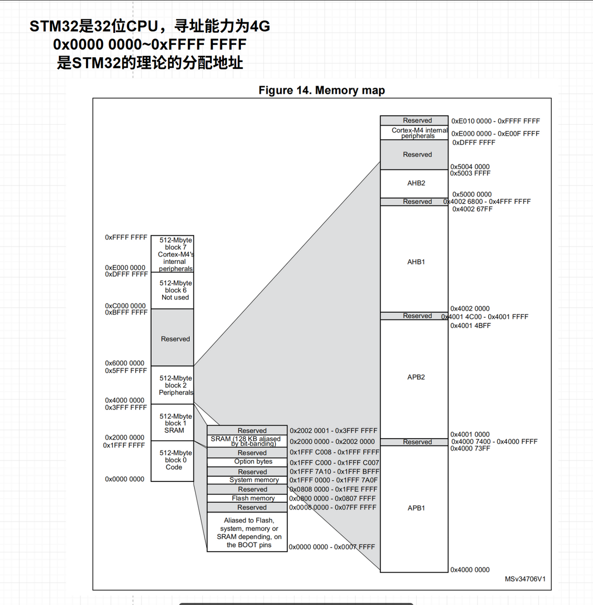
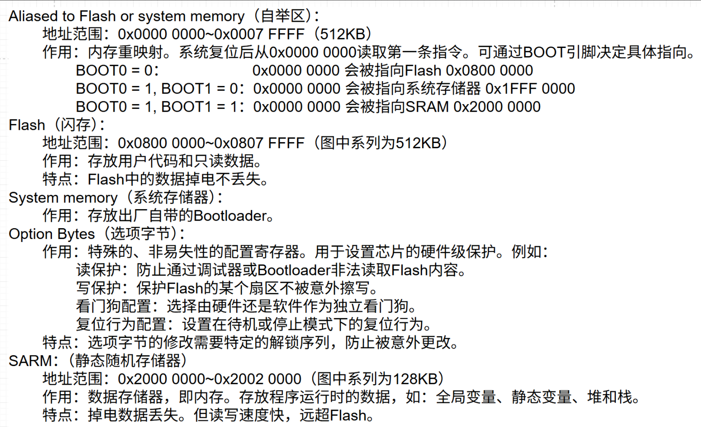
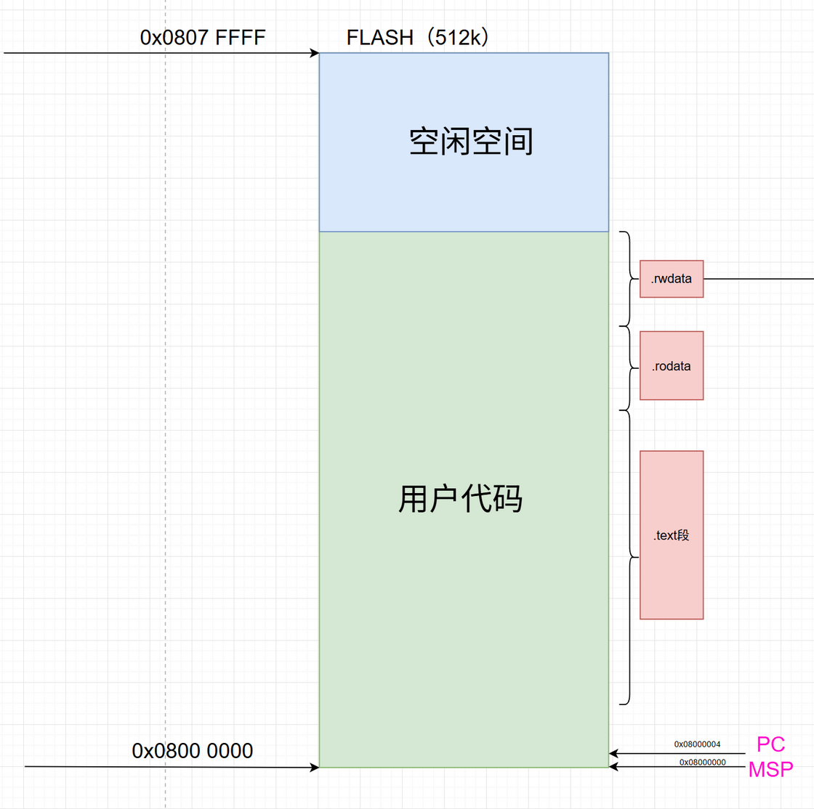
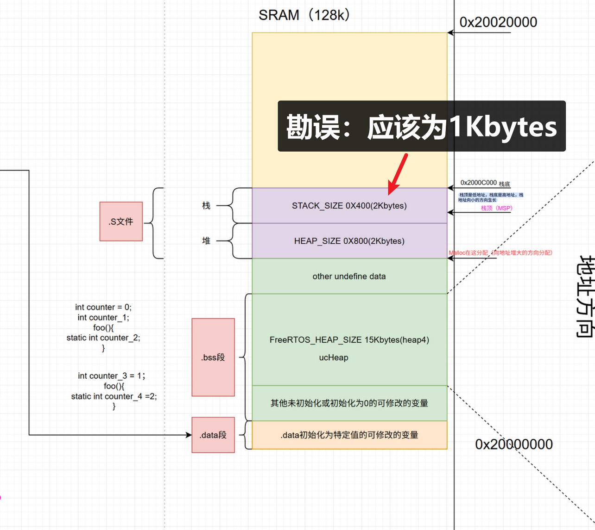

[参考链接01](https://twd6onxsxva.feishu.cn/docx/ZX43d3aFZoFUJixdZrycOT4jnRd)
[参考链接02](https://my.feishu.cn/docx/NYeDdR7dZoDkBZxCrlXcf1DonPd)

---

- STM32的寻址范围与对应的外设地址

---
- 初始化时数据段的分布情况
<table>
	<tr> 
		<td></td>
		<td></td> 
	</tr>
</table>
