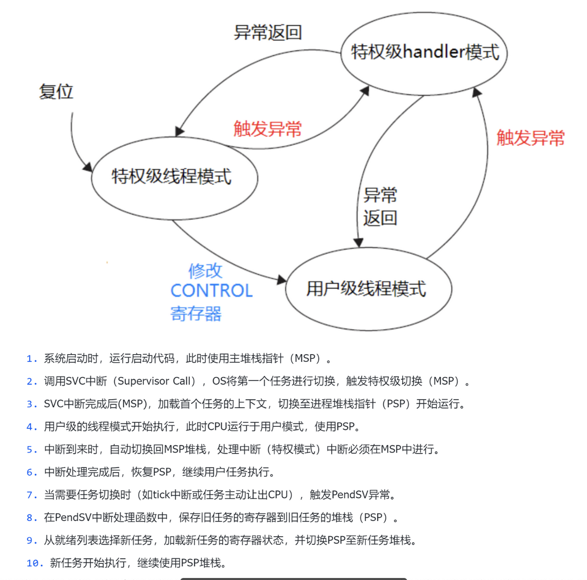

# 一、任务调度

<table>
	<tr> 
		<td></td>
		<td></td> 
	</tr>
</table>


## FreeRTOS 上下文切换完整流程（任务A → 任务B）

---

## 补充知识一：Cortex-M 的处理器模式

Cortex-M 处理器有两个维度的状态：**运行模式**和**特权级别**，组合起来理解。

### 运行模式（Mode）

|模式|何时进入|使用的栈|
|---|---|---|
|**Thread 模式**|正常代码运行时（包括main函数、任务函数）|MSP 或 PSP（可配置）|
|**Handler 模式**|任何异常/中断发生时（HardFault、SysTick、PendSV等）|**强制使用 MSP**|

只有这两种模式，没有更多了。核心区别就是：**Handler 模式一定在处理某个异常，Thread 模式就是普通执行流**。

### 特权级别（Privilege Level）

|级别|说明|
|---|---|
|**Privileged（特权级）**|可以访问所有资源，包括系统控制寄存器（SCB、NVIC等）|
|**Unprivileged（非特权级）**|受限，无法访问系统寄存器，用于保护系统不被任务破坏|

**重要规则**：

- Handler 模式**永远是特权级**，无例外
- Thread 模式**可以是特权级，也可以是非特权级**（由 CONTROL 寄存器的 bit0 决定）
- FreeRTOS 默认任务运行在 **Thread 模式 + 特权级**（简化版），如果开启 MPU 保护才会降到非特权级

### 组合关系图

```
                    ┌─────────────────────────────────────┐
                    │           处理器状态组合              │
                    ├──────────────┬──────────────────────┤
                    │  Handler模式  │  Thread模式           │
                    ├──────────────┼──────────────────────┤
  特权级            │     ✅ 合法   │        ✅ 合法         │
                    │  (异常处理中) │   (FreeRTOS默认任务)   │
                    ├──────────────┼──────────────────────┤
  非特权级          │     ❌ 不存在  │        ✅ 合法         │
                    │             │   (开启MPU时的用户任务)  │
                    └──────────────┴──────────────────────┘
```

### CONTROL 寄存器（控制当前Thread模式的行为）

```
CONTROL[1]：0 = Thread模式用MSP，1 = Thread模式用PSP  ← FreeRTOS设为1
CONTROL[0]：0 = 特权级，        1 = 非特权级
```

FreeRTOS 启动时会把 CONTROL[1] 置1，让任务运行时使用 PSP，这样 MSP 就专门留给异常处理用，两者互不干扰。

---

## 补充知识二：TCB 是什么

TCB（Task Control Block，任务控制块）是 FreeRTOS 中描述一个任务的**核心数据结构**，本质上就是一个 C 结构体。每创建一个任务，FreeRTOS 就在堆上分配一个 TCB。

FreeRTOS 源码中它叫 `tskTCB`（对外暴露为 `StaticTask_t`），关键字段如下：

```c
typedef struct tskTaskControlBlock {

    volatile StackType_t *pxTopOfStack;
    // ↑ 【最重要】永远排在第一位
    //   指向该任务PSP堆栈的当前栈顶
    //   上下文切换时第一个读/写的就是它

    ListItem_t xStateListItem;
    // ↑ 任务状态链表节点
    //   FreeRTOS用链表管理所有任务
    //   通过这个节点把TCB挂到对应链表上：
    //   Ready链表 / Blocked链表 / Suspended链表

    ListItem_t xEventListItem;
    // ↑ 事件链表节点
    //   任务等待信号量/队列时挂到事件链表上

    UBaseType_t uxPriority;
    // ↑ 任务优先级（数字越大优先级越高）

    StackType_t *pxStack;
    // ↑ 指向堆栈空间的起始地址（底部）
    //   和pxTopOfStack不同，这个是固定不变的
    //   用于栈溢出检测

    char pcTaskName[configMAX_TASK_NAME_LEN];
    // ↑ 任务名字字符串，调试用

    UBaseType_t uxBasePriority;
    UBaseType_t uxMutexesHeld;
    // ↑ 优先级继承相关（防止优先级反转）

    uint32_t ulNotifiedValue[1];
    uint8_t  ucNotifyState[1];
    // ↑ 任务通知机制相关（轻量级信号量）

    uint8_t ucStaticallyAllocated;
    // ↑ 标记TCB和堆栈是静态还是动态分配的

} tskTCB;
```

### TCB 和堆栈的关系图

```
RAM中的布局：

┌─────────────────────┐  ← pxStack（栈底，地址低）
│                     │
│   任务A的堆栈空间    │
│   （存CPU现场快照）  │
│                     │
│  R4                 │
│  R5                 │
│  ...                │
│  EXC_RETURN         │
│  R0~R3,PC,xPSR...  │
├─────────────────────┤  ← pxTopOfStack 指向这里（栈顶，随push/pop变化）
│       ...           │
└─────────────────────┘  （堆栈向下增长）

┌─────────────────────┐
│  任务A的 TCB 结构体  │
│  pxTopOfStack ──────┼──→ 指向上面的栈顶位置
│  uxPriority   = 2   │
│  pcTaskName = "A"   │
│  xStateListItem     │
│  ...                │
└─────────────────────┘
```

**上下文切换时只需要读写 `pxTopOfStack` 这一个字段**，所以它被放在结构体第一位，可以用最简单的指针解引用访问，不需要计算偏移量，汇编代码写起来最高效。

---

## 补充知识三：EXC_RETURN 的含义

你的理解是对的——EXC_RETURN 本质上是一个**编码了"我从哪里来"的魔术值**，CPU 用它来决定"我应该怎么回去"。

### 它长什么样

EXC_RETURN 是一个 32 位值，高28位固定是 `0xFFFFFF_`，低4位是有效信息：

```
EXC_RETURN = 0xFFFFFFXX

bit[3]：返回后用哪个栈？
        1 = 用PSP（Thread模式任务）
        0 = 用MSP（嵌套异常）

bit[2]：目前未用（Cortex-M4固定为1）

bit[1]：保留，固定为1

bit[0]：返回到哪个模式？
        1 = Thread模式
        0 = Handler模式（用于异常嵌套）
```

### FreeRTOS 中最常见的两个值

|值|含义|使用场景|
|---|---|---|
|`0xFFFFFFFD`|返回 Thread 模式，用 PSP|**FreeRTOS 任务正常运行时**（最常见）|
|`0xFFFFFFF9`|返回 Thread 模式，用 MSP|裸机无RTOS时|
|`0xFFFFFFF1`|返回 Handler 模式，用 MSP|中断嵌套时|

### 为什么要把它压栈保存

这是你问题的核心，原因很简单：

**EXC_RETURN 需要在退出异常时执行 `BX LR` 用到，但 PendSV_Handler 运行期间 LR 会被各种函数调用和汇编操作覆盖掉，如果不提前保存就丢失了。**

具体来说：

```
PendSV_Handler 入口时：
  LR = 0xFFFFFFFD  ← 硬件写入的EXC_RETURN，代表"任务A是Thread模式+PSP"

PendSV_Handler 中调用 vTaskSwitchContext()：
  LR 被覆盖！变成了 vTaskSwitchContext 的返回地址

如果没有提前把 0xFFFFFFFD 压栈保存：
  BX LR 时 LR 已经是错误的值，CPU 不知道该返回什么模式 → 崩溃
```

所以软件手动入栈时，必须把 LR（EXC_RETURN）也 PUSH 进任务A的堆栈，出栈时再 POP 回来，才能正确执行 `BX LR` 完成异常返回。

并且，EXC_RETURN 里编码了**任务所使用的栈类型（PSP）和模式（Thread）**，`BX LR` 执行时 CPU 读取这个值，才知道：

- 要切换回 Thread 模式（而不是继续 Handler 模式）
- 要用 PSP 恢复现场（从任务B的PSP栈弹出R0~R3等）

这正好回答了你的问题：**EXC_RETURN 就是用来驱动模式切换的关键凭证**。

---

## FreeRTOS 上下文切换完整流程（任务A → 任务B）

---

### 前置理解：两个关键硬件机制

**① 双栈指针**：Cortex-M 有两个栈指针，MSP（主栈）和 PSP（进程栈）。正常任务运行时用 PSP，进入异常 Handler 时自动切换到 MSP。每个任务都有自己独立的 PSP 栈空间。FreeRTOS 启动时配置 CONTROL 寄存器让任务使用 PSP，MSP 专留给异常。

**② 硬件自动入栈**：任何异常发生时，Cortex-M 硬件会**自动**把当前 CPU 的一部分寄存器压到当前任务的 PSP 栈上，软件不用管。压的内容固定是：

```
xPSR, PC, LR(返回地址), R12, R3, R2, R1, R0
```

---

### 第一阶段：触发切换

系统时钟 SysTick 中断触发，FreeRTOS 判断需要切换任务。

此时它不直接切换，而是**悬挂 PendSV 异常**（把 PendSV 标记为"待执行"）。等所有其他中断都处理完毕后，PendSV 才开始执行。这样设计是为了让上下文切换永远发生在所有中断的末尾，避免打断其他 ISR。

---

### 第二阶段：保存任务A的现场（"冻结"任务A）

PendSV_Handler 开始执行，CPU 进入 **Handler 模式**，自动切换到 **MSP**。但接下来对任务A现场的所有操作，全都针对任务A的 **PSP 栈**。

#### 步骤1：硬件自动入栈（进入PendSV的瞬间完成）

硬件把以下8个寄存器压入任务A的PSP栈：

```
R0, R1, R2, R3, R12, LR(返回地址), PC, xPSR
```

同时，硬件把 **EXC_RETURN**（值为 `0xFFFFFFFD`）写入 LR 寄存器——注意是**写入LR本身，不是压栈**。它编码了"任务A是Thread模式+PSP"这个信息，退出异常时需要用它来还原模式。

#### 步骤2：软件手动入栈（PendSV汇编代码执行）

硬件只自动保存了8个寄存器，剩下的 R4~R11 硬件不管，需要软件自己压栈。同时，由于接下来会调用 C 函数（`vTaskSwitchContext`）导致 LR 被覆盖，必须**提前把 LR（即EXC_RETURN）也压栈保存**：

```asm
MRS R0, PSP
STMDB R0!, {R4-R11, LR}   ; 把R4~R11和EXC_RETURN一起压入任务A的PSP栈
```

#### 步骤3：把PSP栈顶指针保存到任务A的TCB

```asm
STR R0, [任务A的TCB.pxTopOfStack]
```

此时任务A的PSP栈完整布局：

```
高地址 ──────────────────────────────────────
         xPSR                   ┐
         PC（被打断时的地址）      │  硬件自动压入
         LR（函数返回地址）        │
         R12                    │
         R3                     │
         R2                     │
         R1                     │
         R0                     ┘
         ─────────────────────────────────────
         EXC_RETURN（0xFFFFFFFD）┐
         R11                    │  软件手动压入
         R10                    │
         R9                     │
         R8                     │
         R7                     │
         R6                     │
         R5                     │
         R4                     ┘
低地址 ← PSP / pxTopOfStack 指向这里
```

至此任务A被彻底"冻结"，所有 CPU 现场都安全保存在它自己的堆栈里。

---

### 第三阶段：恢复任务B的现场（"解冻"任务B）

#### 步骤4：调度器选出任务B

```c
vTaskSwitchContext();   // pxCurrentTCB 更新为指向任务B的TCB
```

#### 步骤5：从任务B的TCB取出栈顶指针，写入PSP

```asm
LDR R0, [任务B的TCB.pxTopOfStack]
MSR PSP, R0
```

PSP 现在指向任务B上次保存现场时的栈顶。

#### 步骤6：软件手动出栈

```asm
LDMIA R0!, {R4-R11, LR}   ; 弹出R4~R11，并把EXC_RETURN弹回LR
```

LR 现在持有任务B当初保存的 EXC_RETURN（也是 `0xFFFFFFFD`）。

#### 步骤7：BX LR 触发异常返回

```asm
BX LR    ; CPU识别到LR是EXC_RETURN魔术值，执行异常返回流程
```

CPU 读取 EXC_RETURN = `0xFFFFFFFD`，得知：

- bit[3]=1 → 用 PSP 恢复现场
- bit[0]=1 → 切换回 Thread 模式

于是硬件自动从任务B的PSP栈弹出剩余8个寄存器：

```
R0, R1, R2, R3, R12, LR(返回地址), PC, xPSR
```

PC 被设置为任务B上次被打断时的地址，**CPU 从那里继续执行**，同时切换回 Thread 模式 + PSP。

---

### 第四阶段：切换完成

任务B从它上次被打断的地方无缝继续运行，完全感知不到自己曾经被暂停过。

---

### 全流程一张图

```
任务A运行（Thread模式，PSP）
    │
    │  SysTick触发，悬挂PendSV
    ▼
进入PendSV_Handler → 切换到Handler模式，用MSP
    │
    ├─ [硬件] R0~R3,R12,LR,PC,xPSR → 压入任务A的PSP栈
    ├─ [硬件] EXC_RETURN(0xFFFFFFFD) → 写入LR寄存器
    │
    ├─ [软件] R4~R11 + LR(EXC_RETURN) → 压入任务A的PSP栈
    ├─ [软件] PSP栈顶 → 保存到任务A的TCB.pxTopOfStack
    │
    ├─ [调度器] pxCurrentTCB 切换为任务B
    │
    ├─ [软件] 任务B的TCB.pxTopOfStack → 写入PSP
    ├─ [软件] 从任务B的PSP栈弹出 R4~R11 + EXC_RETURN → LR
    │
    └─ BX LR（EXC_RETURN = 0xFFFFFFFD）
           │
           ├─ [硬件] 从任务B的PSP栈弹出 R0~R3,R12,LR,PC,xPSR
           └─ [硬件] 切换回Thread模式，使用PSP
                  │
                  ▼
             任务B从断点处继续运行（Thread模式，PSP）
```